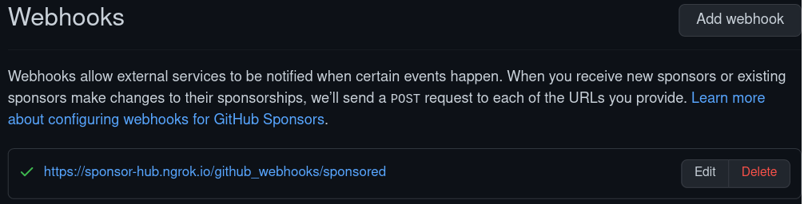

# README

## Development Environment

## Configuration
1. ### web-console requires setting allowed ips 
- **github webhook callback ips** are added to `config.web_console.allowed_ips`  
- gem https://github.com/rails/web-console
- see `config/application.rb`

2. ### https is required for github sponsor webhook
- currently using https://ngrok.com/ to create public url for https://localhost
- added to `config.hosts` to permit callback
- configured in `config/environments/development.rb`
    - checked in order:
        1. environment variable `HTTPS_LOCALHOST`
        2. `config/connections.yml`

3. ### Setting up a Github sponsor webhook
- Visit `https://github.com/sponsors/(username)/dashboard` to manage your sponsorship profile.

- Your sponsorship webhook is defined here
`https://github.com/sponsors/(username)/dashboard/webhooks`
  - the callback path is `/github_webhooks/sponsored`
  - in development you can use a service like [ngrok.com](https://ngrok.com) to create a proxy for `https://localhost`
  - webhook screen shot from the **sponsors** page
  

 